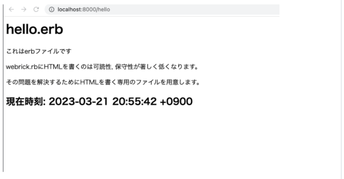
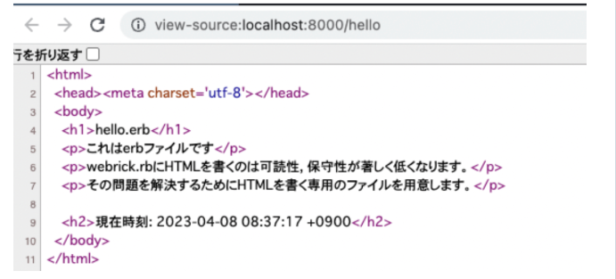

## 【課題04】2023/06/13 _Webの基礎_Webサーバを立ち上げてWebの仕組みを知る（動的ページ erb 編）

前回までの課題では動的なHTMLの生成ロジックを全てwebrick.rbに書いていました。
例
```
server.mount_proc("/time") do |req, res|
  # レスポンス内容を出力
  body = "<html><body>\n"
  body += "#{Time.new}"
  body += "</body></html>\n"
  res.status = 200
  res['Content-Type'] = 'text/html'
  res.body = body
end
```

これくらいシンプルなHTMLであればそれでも支障はありませんが、現実のWebサービスはもっと複雑です。

複雑なHTMLの生成ロジック（条件分岐や繰り返しなどを想像してみてください）を全てwebrick.rbに書こうとするとたちまちメンテナンスができなくなるのは想像に難くありません。

なので一般的なWebアプリケーションフレームワーク（Ruby on Rails, Laravel etc）ではMVC（モデル, ビュー, コントローラ）などのアーキテクチャを採用していることが多いです。

この「Webサーバを立ち上げてWebの仕組みを知る」の課題でいうとコントローラ的な役割を持つのがwebrcik.rbですが、
これまでの課題の実装方針でいうとそのコントーラでHTMLの生成処理まで行なってしまっています。
そこでHTMLの生成処理は別のファイルに移そう、というのが当課題の目的です。

課題

http://localhost:8000/hello で以下の画面が表示されるようにしてください。



補足情報

- helllo.erbファイルを作ると良いでしょう
- 「これはerbファイルです〜〜〜〜専用のファイルを用意します。」はerbファイルに直書きしてOKです
- 一方で「現在時刻」部分は動的に出力してみましょう。Railsをやったことがある人には馴染みがあるかもしれませんが、インスタンス変数をwebrick.rbに定義してやればそれをそのままerbファイルの中でも使えます。
- 以下を参考にしてみてください。

```
require "erb" # erbをrequireする記述が必要
# erb を使うにはこういった記述が必要。理解する必要はありません。このまま使いましょう。
WEBrick::HTTPServlet::FileHandler.add_handler("erb", WEBrick::HTTPServlet::ERBHandler)
server.config[:MimeTypes]["erb"] = "text/html"
server.mount_proc("/hello") do |req, res|
  template = ERB.new( File.read('hello.erb') )
  # 現在時刻についてはインスタンス変数をここで定義してみるといいかも？
  res.body << template.result( binding )
end
```

アドレス遷移時に変数を設定
→HTML内で変数を展開

LayoutEnterのスクリプトトリガみたいなもの？

Chromeで右クリックメニューから「ソースの表示」を見るとサーバから返ってきたHTMLが確認できます。「サーバ側でHTMLを組み立てて最終的にできたものをクライアントに返す」のイメージをつかんでください。



追記
```
 WEBrick::HTTPServlet::FileHandler.add_handler("erb", WEBrick::HTTPServlet::ERBHandler)
 server.config[:MimeTypes]["erb"] = "text/html"

 server.mount_proc("/hello") do |req, res|
   template = ERB.new( File.read('hello.erb') )
   @now = Time.new
   res.body << template.result( binding )
 end
```

作成
```
<html>
<head><meta charset='utf-8'></head>
<body>
<h1>hello.erb</h1>
<p>これはerbファイルです</p>
<p>webrick.rbにHTMLを書くのは可読性, 保守性が著しく低くなります。</p>
<p>その問題を解決するためにHTMLを書く専用のファイルを用意します。</p>

<h2>現在時刻: <%= @now %></h2>
</body>
</html>
```

