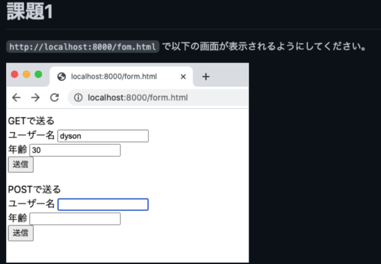
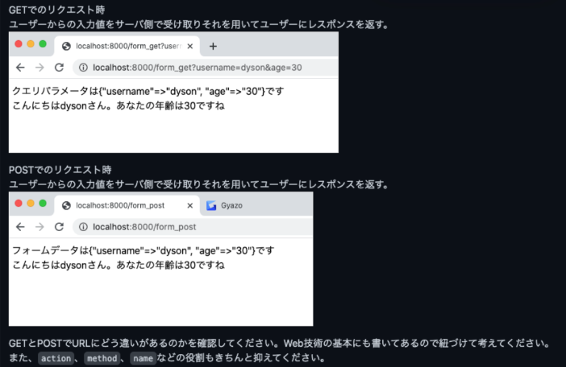
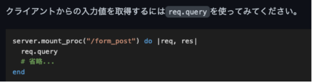

## 【課題05】2023/06/08 _Webの基礎_Webサーバを立ち上げてWebの仕組みを知る（フォーム編）

https://kakedashi-hub.tech/practices/10

【課題04_1】フォーム画面作成

/formで以下ページが表示されるようにして下さい。
GETで送る
ユーザー名　入力箇所
年齢　　　　入力箇所

POSTで送る
ユーザー名　入力箇所
年齢　　　　入力箇所

【課題04_2】GETとPOSTでのフォーム送信

[ヒント]
https://developer.mozilla.org/ja/docs/Learn/Forms/Your_first_form

<form action="/form_get" method="post"></form>
action データを送信したい場所 webrickのserver.mount_proc()と一致させる
method getまたはpost ←この差は？
 →get: 取得用。URLに表示される。パスワードや個人情報に注意。URL に状態が乗るため「再現性」が高い。キャッシュも効く。
 →post: 送信用。URLに表示されない。機密性少し高い。

getとpostでwebrickに違いは出ない？

<label for="name">なまえをにゅうりょく<label>
<input type="text" id="name" name="user_name" />

labelのforとinputのidを一致させることで、ラベルクリック時に入力欄がフォーカスされる
 →ラジオボタンやチェックボックスなどに便利
inputのnameとreq.query[]を一致させる

https://developer.mozilla.org/ja/docs/Learn/Forms/Sending_and_retrieving_form_data

