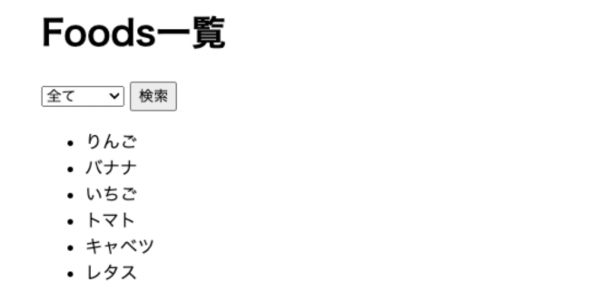

## 【課題06】Webの基礎_Webサーバを立ち上げてWebの仕組みを知る（総集編）

https://kakedashi-hub.tech/practices/40

これまでやってきたことを応用して簡易的な検索機能を作ってください。
- 「全て」を選択したら全ての食べ物が表示される
- 「フルーツ」を選択したらフルーツのみが表示される
- 「野菜」を選択したら野菜のみが表示される

[ヒント]
その他、erb
ファイルも自分で作る必要があります。
selectに関してはこちらを参考にしてみてください。name, value selected あたりがキーになってくると思います。

https://developer.mozilla.org/ja/docs/Web/HTML/Element/select#%E4%BE%8B

